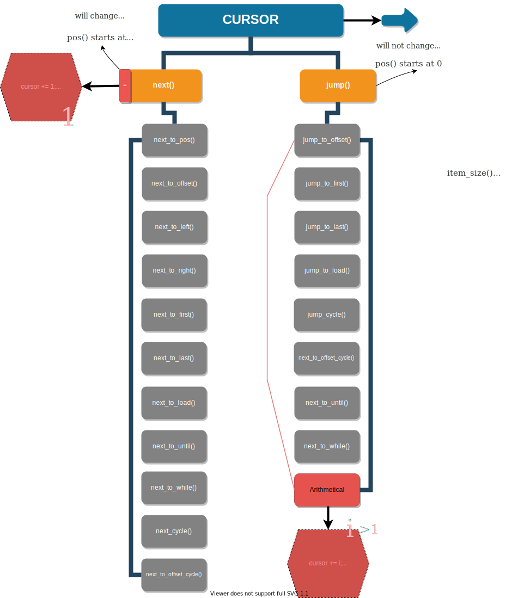

# ***`CURSOR` ***  


A more free Rust-Iterator.

[![CI][ci-badge]][ci-url]
[![Crates.io][crates-badge]][crates-url]
[![Licensed][license-badge]][license-url]
[![Twitter][twitter-badge]][twitter-url]

[ci-badge]: https://github.com/just-do-halee/cursor/actions/workflows/rust.yml/badge.svg
[crates-badge]: https://img.shields.io/crates/v/cursor.svg?labelColor=383636
[license-badge]: https://img.shields.io/crates/l/cursor?labelColor=383636
[twitter-badge]: https://img.shields.io/twitter/follow/do_halee?style=flat&logo=twitter&color=4a4646&labelColor=333131&label=just-do-halee

[ci-url]: https://github.com/just-do-halee/cursor/actions
[twitter-url]: https://twitter.com/do_halee
[crates-url]: https://crates.io/crates/cursor
[license-url]: https://github.com/just-do-halee/cursor
| [Examples](./examples) | [Docs](https://docs.rs/cursor) | [Latest Note](./CHANGELOG.md) |

```toml
[dependencies]
cursor = "2"
# { version = "2", default-features = false } == no-std
```

---



---

# [Examples](./examples)

```rust
use cursor::*;
```
---
```rust
fn example7() -> u8 {

    let mut cursor = Cursor::new(&[1u8; 100]);
    cursor += 5;
    cursor -= 2;
    cursor += 1;

    cursor.current_deref()

}
```
---
```rust
fn example9() {

    let mut cursor = StrCursor::new("test입니다. ^^");
    cursor += 5;

    assert_eq!(cursor.as_preserved_str(), "test입");
    assert_eq!(cursor.current(), '니');
    assert_eq!(cursor.as_remaining_str(), "다. ^^");

}
```

#### *Please check the [examples folder](./examples) for detailed features.*